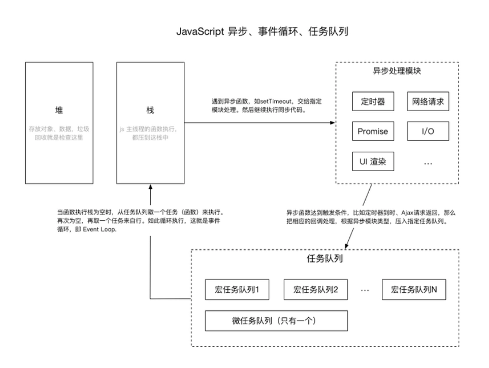

## JS（非框架）

#### 数据的类型有哪些

- 数据类型	
  - 基本类型：undefined、NULL 、Number、Boolean、String
  - 复杂类型：Object、Symbol

- 检测数据类型的方法

  1. typeof

     ```javascript
     console.log(typeof 123); //number
     console.log(typeof 'abc'); //string
     console.log(typeof true); //boolean
     console.log(typeof undefined); //undefined
     console.log(typeof null); //object
     console.log(typeof [1,2,3]); //object
     console.log(typeof {a:1,b:2,c:3}); //object
     console.log(typeof function(){}); //function
     console.log(typeof Symbol()); //symbol
     ```

  2. instanceof

  3. constructor

     ```javascript
     let num = 123;
     console.log(num.constructor); //ƒ Number() { [native code] }
     console.log(''.constructor); //ƒ String() { [native code] }
     console.log(true.constructor); //ƒ Boolean() { [native code] }
     console.log([].constructor); //ƒ Array() { [native code] }
     console.log({}.constructor); //ƒ Object() { [native code] }
     console.log(function(){}.constructor); //ƒ Function() { [native code] }
     console.log(new Date().constructor); //ƒ Date() { [native code] }
     console.log(new RegExp().constructor); //ƒ RegExp() { [native code] }
     console.log(Symbol().constructor); //ƒ Symbol() { [native code] }
     
     ```

  4. Object.prototype.toString.call().slice(8,-1)

     ```javascript
     const checkType = (val) => {
         let type = Object.prototype.toString.call(val).slice(8, -1);
         console.log(type)
     }
     checkType('')//String
     checkType(null)//Null
     checkType([])//Array
     checkType({})//Object
     checkType(function () { })//Function
     checkType(new RegExp())//RegExp
     checkType(new Date())//Date
     checkType(undefined)//Undefined
     checkType(1)//Number
     checkType(Symbol())//Symbol
     checkType(true)//Boolean
     ```
     
     
     

#### 堆栈的理解

栈存放的是基本类型数据，简单数据类型，堆存放的是引用类型的数据，复杂数据类型，当let 或者 const 时，会遍历栈，没有会添加，否则报错。当然，const定义的常量，也就是指针，指向栈中的地址，改变这个指针是不被允许的，但改变对象中的值并不会改变它的指针，是可以的

#### `object.is()`、"`==` " 、 " `===` "的区别

- "`===`"先进行类型转换，再判断是否相等
- "`===`",类型相等才相等
- `object.is()` 与"`===`"基本一致，不过有两点不同：(NAN和NAN相等)；+0和-0不相等

#### 数组的方法

##### `Array.from()`

```javascript
// 1.
Array.from('abc')//['a','b','c']
// 2.
let arr=[1,2,3];
Array.from(arr,(item)=>{console.log(item)})//1,2,3
```

<font size="2" face="arial" color="#666">【**返回值**】：新的数组实例</font>

##### `Array.isArray()`

<font size="2" face="arial" color="#666">【**作用**】：判断是否为数组.</font>

```javascript
Array.isArray([1]) //true
```

<font size="2" face="arial" color="#666">【**返回值**】：布尔值.</font>

##### `Array.of()`

<font size="2" face="arial" color="#666">【**作用**】：生成数组</font>

```javascript
Array.of(1)//[1]    创建新的数组，参数是任意类型
```

<font size="2" face="arial" color="#666">【**返回值**】：新的数组实例</font>

##### `concat()`

<font size="2" face="arial" color="#666">【**作用**】：合并数组</font>

```javascript
  let arr=[1,2],arr2=[3,4],arr3=[5,6];
  let newArr=arr.concat(arr2,arr3) //[1,2,3,4,5,6]
  console.log(arr) //[1,2]
```

<font size="2" face="arial" color="#666">【**返回值**】：新的数组实例，不改变原数组</font>

##### `every()`

<font size="2" face="arial" color="#666">【**作用**】：数组中所有元素是否都满足条件</font>

```javascript
let arr=[1,2,3];
arr.every(item => item > 1)//false
arr.every(item => item > 0)//true
```

<font size="2" face="arial" color="#666">【**返回值**】：布尔值</font>

##### `filter()`

<font size="2" face="arial" color="#666">【**作用**】：获取数组中满足条件的元素</font>

```javascript
let arr=[1,2,3];
let newArr=arr.filter(item => item > 1) //[2,3]
```

<font size="2" face="arial" color="#666">【**返回值**】：满足条件的元素数组，不改变原数组</font>

##### `find()`

<font size="2" face="arial" color="#666">【**作用**】：查找数组中符合条件第一个元素的值</font>

```javascript
let arr=[1,2,3],arr2=[{val:1},{val:2},{val:3}];
arr.find(item => item >= 1)//1
arr2.find(item => item.val > 1) //{val:2}
//和filter的区别：find方法返回符合条件的第一个元素，filter则是返回符合条件的所有元素，返回新的数组
```

<font size="2" face="arial" color="#666">【**返回值**】：符合条件的元素，不改变原数组</font>

##### `findIndex()`

<font size="2" face="arial" color="#666">【**作用**】：查找数组中满足条件的第一个元素的索引</font>

```javascript
let arr=[1,2,3];
arr.findIndex(item => item > 1) // 1
arr.findIdnex(item => item > 4) //-1
```

<font size="2" face="arial" color="#666">【**返回值**】：第一个符合条件的索引，没有则返回 -1</font>

##### `flat()`

<font size="2" face="arial" color="#666">【**作用**】：数组扁平化</font>

```javascript
let arr = [1, 2, [3, 4]];
arr.flat() //[1, 2, 3, 4]
let arr1=[1,[2,[3]]]
arr1.flat(2) // [1, 2, 3];
//使用 Infinity，可展开任意深度的嵌套数组
arr1.flat(Infinity) //[1, 2, 3]
```

<font size="2" face="arial" color="#666">【**返回值**】：新的数组，不改变原数组</font>

##### `forEach()`

<font size="2" face="arial" color="#666">【**作用**】：遍历数组</font>

<font size="2" face="arial" color="#666">【**返回值**】：无返回值</font>

##### `includes()`

<font size="2" face="arial" color="#666">【**作用**】：查找数组中是否包含某一项</font>

```javascript
let arr=[1,2,3];
arr.includes(2) //true
let arr2=[1,2,1,3,4,5,6];
// 第二个参数为查找的索引起始位置（包含），为负数则从后向前的绝对值
arr2.includes(2,1) //true
arr2.includes(2,2) //false
arr2.includes(2,-6) //true
let str='abc';
// 也可以查找字符串是否包含某个字符
str.includes('a') //true
```

<font size="2" face="arial" color="#666">【**返回值**】：布尔值</font>

##### `indexOf()`

<font size="2" face="arial" color="#666">【**作用**】：数组中（字符串）包含指定元素的第一个索引</font>

```javascript
// 特别说明
// indexOf的第二个参数,从第几个开始，为负数则从后向前
let arr=[1,2,3,2];
arr.indexOf(2,2) // 3 
arr.indexOf(2,5) // -1 为正数的时候，如果大于length，则返回-1
arr.indexOf(2,-3) // 1 
arr.indexOf(2,-5) // 1 如果绝对值大于length，则从数组第一项开始找
```

<font size="2" face="arial" color="#666">【**返回值**】：索引值或 -1 </font>

##### `join()`

<font size="2" face="arial" color="#666">【**作用**】：将数组分割成字符串并进行连接</font>

<font size="2" face="arial" color="#666">【**返回值**】：字符串，不改变原数组</font>

##### `lastIndexOf()`

<font size="2" face="arial" color="#666">【**作用**】：数组（字符串）中最后一个指定元素的索引</font>

```javascript
//特别说明
//lastIndexOf第二个参数
let arr=[1,2,3,2];
arr.lastIndexOf(2,2) // 1 正数为查找到第几个索引为止
arr.lastIndexOf(2,-3) //1 负数为从后向前，查找到第几个索引（绝对值），大于length则返回 -1 
```

<font size="2" face="arial" color="#666">【**返回值**】：索引值或 -1 </font>

##### `map()`

<font size="2" face="arial" color="#666">【**作用**】：遍历数组</font>

<font size="2" face="arial" color="#666">【**返回值**】：元素执行函数后组成的新数组 </font>

##### `pop()`

<font size="2" face="arial" color="#666">【**作用**】：删除数组的最后一项</font>

<font size="2" face="arial" color="#666">【**返回值**】：删除的元素，改变原数组 </font>

##### `push()`

<font size="2" face="arial" color="#666">【**作用**】：数组后添加一或多项</font>

<font size="2" face="arial" color="#666">【**返回值**】：数组的长度，改变原数组 </font>

##### `shift()`

<font size="2" face="arial" color="#666">【**作用**】：删除数组第一项</font>

<font size="2" face="arial" color="#666">【**返回值**】：删除的元素，改变原数组 </font>

##### `unshift()`

<font size="2" face="arial" color="#666">【**作用**】：数组前添加一项或多项</font>

<font size="2" face="arial" color="#666">【**返回值**】：数组的长度，改变原数组 </font>

##### `reduce()`

##### `reverse()`

<font size="2" face="arial" color="#666">【**作用**】：翻转数组</font>

<font size="2" face="arial" color="#666">【**返回值**】：翻转后的数组，改变原数组 </font>

##### `slice()`

<font size="2" face="arial" color="#666">【**作用**】：返回数组或字符串的一部分</font>

```javascript
let arr=[1,2,3,4]
arr.slice() // [1,2,3,4]
arr.slice(2) //[3]
arr.slice(4) // []
arr.slice(-2) // [3,4] 如果该参数为负数，表示从原数组中的倒数第几个元素开始提取到最后一个
arr.slice(2,3)//3 不包含end
```

<font size="2" face="arial" color="#666">【**返回值**】：新数组或新的字符串，不改变原数组 </font>

##### `some()`

<font size="2" face="arial" color="#666">【**作用**】：数组中是否有元素满足传入的函数条件</font>

<font size="2" face="arial" color="#666">【**返回值**】：布尔值 </font>

##### `sort()`

<font size="2" face="arial" color="#666">【**作用**】：数组排序</font>

> 如果指明了 fn，那么数组会按照调用该函数的返回值排序。即 a 和 b 是两个将要被比较的元素：
>
> 如果 fn(a, b) 小于 0 ，那么 a 会被排列到 b 之前；
> 如果 fn(a, b) 等于 0 ， a 和 b 的相对位置不变。
> 如果 fn(a, b) 大于 0 ， b 会被排列到 a 之前。
> fn(a, b) 必须总是对相同的输入返回相同的比较结果，否则排序的结果将是不确定的。

<font size="2" face="arial" color="#666">【**返回值**】：新数组，不改变原数组 </font>

##### `splice()`

<font size="2" face="arial" color="#666">【**作用**】：删除或替换现有元素或者原地添加新的元素来修改数组</font>

```javascript
let arr = [1,2,3,4];
arr.splice(2) // [3,4] //arr:[1,2]
arr.splice(-2) // [3,4] //arr:[1,2]
arr.splice(2,2) // [3,4] //arr:[1,2]
arr.splice(2,0,2)//[] //arr:[1,2,2,3,4]
arr.splice(2,1,2) // [] arr:[1,2,2,4]
```

<font size="2" face="arial" color="#666">【**返回值**】：被删除元素组成新数组，改变原数组 </font>

##### `toString()`

<font size="2" face="arial" color="#666">【**作用**】：将数组转换成字符串</font>

`和join()的区别：join()可以指定连接符`

<font size="2" face="arial" color="#666">【**返回值**】：字符串，不改变原数组</font>

#### 对象的方法

-  **`Object.assign()`**

  将一个或多个源对象复制到目标对象中，且源对象会随之改变

  当复制的对象的属性值为简单数据类型时，为深拷贝，当复制的属性值为复杂数据类型时，为深拷贝

#### 函数提升和变量提升

es6之前没有块级作用域

- 变量提升

  ```javascript
  console.log(v1);       //undefined
  var v1 = 100;
  function foo() {
      console.log(v1);   //undefined
      var v1 = 200;     
      console.log(v1);   //200
  }
  foo();
  console.log(v1);       //100
  
  //其实类似于下面的
  var v1;
  console.log(v1);
  v1 = 100;
  function foo() {
      var v1;
      console.log(v1);
      v1 = 200;
      console.log(v1);
  }
  foo();
  console.log(v1); 
  ```

- 函数提升

  ```javascript
  //函数声明式
  function bar () {}    //  会提升到该作用域的最顶端，而且高于变量提升。
  //函数字面量式 
  var foo = function () {}  //没有函数提升
  ```

#### ES6新特性

##### let 和 const

区别：let 和 var都是声明变量，let 有块级作用域，同一作用域下不允许重复声明；const声明常量，[不可改变](#堆栈的理解)

##### 扩展运算符

- `...`   将一个数组转为用逗号分隔的参数序列，可以用来深拷贝数组，合并数组等操作，也可以将字符串转成数组
- 和 `rest` 正好相反

##### 模板字符串

##### [异步](#JS中的异步)

##### Set和Map数据结构

- Set数据结构
  - 成员值唯一，不会重复
  - 使用`new Set()`创建一个Set数据结构
  - 不会发生数据类型转换
-  Map 数据结构
  - 解决JS对象只能用字符串作为键的限制
  - get 和set 方法

##### 箭头函数

- 值得注意，箭头函数的[this](#this的指向)来自父级
- 不能使用arguments对象
- 不能作为构造函数
- 不可使用 yield

##### 解构赋值

从数组和对象中提取值，对变量进行赋值

##### 函数默认参数

#### 柯里化函数

#### 构造函数

- new 函数名实例化对象的函数，一般首字母大写
- 通过this设置属性和方法
- new做了什么呢：
  - 创建一个新对象；
  - 将构造函数的作用域赋给新对象（因此 this 就指向了这个新对象） ；
  -  执行构造函数中的代码（为这个新对象添加属性） ；
  - 返回新对象。

#### 原型和原型链

每个对象都有一个`__proto__` ,指向它的 `prototype`原型对象，每个构造函数都有一个`prototype`原型对象，里面的`constructor` 指向这个构造函数本身

当寻找一个属性时，首先在对象上找，如果找不到，则顺着`__proto__`寻找它的 `prototype`对象，一层一层逐级寻找，直到找到并返回，原型链的终点为null

[传送门](https://zhuanlan.zhihu.com/p/35790971)

https://segmentfault.com/a/1190000008739672

#### Class

类的数据类型就是函数，类本身就指向构造函数。

必须使用`new`命令，才能使用类

`static`关键字不会被实例继承

`constructor`方法是类的默认方法，默认返回实例对象（即`this`），通过`new`命令生成对象实例时，自动调用该方法。一个类必须有`constructor`方法，如果没有显式定义，一个空的`constructor`方法会被默认添加。

类里面共有的属性和方法必须使用this访问

#### 继承

```javascript
function Father(name) {
    //属性
    this.name = name || 'Annie'
    //实例方法
    this.sleep = () => {
        console.log('名字：'+this.name)
    }
}
//原型方法
Father.prototype.eat = function (food) {
    console.log(this.name + '正在吃：' + food);
}
```

- 原型链继承

  ```javascript
  let Son = function () {};
  Son.prototype = new Father() // 创建实例时父类构造函数中传参数无效
  Son.prototype.name = 'Remons'
  let child = new Son() 
  child.sleep() // 名字：Remons
  ```

- 构造函数继承

  ```javascript
  function Son(name) {
      Father.call(this);
      this.name = name
  }
  let Child = new Son('Remons')
  Child.sleep() // 名字：Remons
  // 无法继承父级原型上的方法和属性  Child.eat is not a function
  ```

- 原型继承

  ```javascript
  function Son(name) {
      let this_ = new Father()
      this_.name = name;
      return this_
  }
  let Child = new Son('Remons') 
  Child.sleep() // 名字：Remons
  ```

- Class继承

  ```javascript
  class Father{
      constructor(x,y){
          this.x=x;
          this.y=y
      }
      sum(){
          return this.x + this.y
      }
  }
  class Son extends Father{
      constructor(x,y){
          super(x,y) // 必须先使用super，才能访问this，用来调用父类的属性和方法
      }
  }
  let sum=new Son(5,6)
  console.log(sum.sum()) // 11
  ```

#### this的指向

- 如果一个函数中有this，这个函数被上一级的对象所调用，this指向上一级的对象
- 如果一个函数中有this，这个函数中包含多个对象，尽管这个函数是被最外层的对象所调用，this指向上一级的对象
- this永远指向的是最后调用它的对象
- 箭头函数的this指向父级
- 如何改变this指向
  - call,apply,bind   区别：call和bind挨个传值，apply传一个数组，call和apply会直接执行这个函数

#### Event-loop、事件队列、微任务和宏任务



常见的宏任务：setTimeout , setInterval

常见的微任务Promise.then,catch,finally

Even-loop:

在执行完同步任务后，会执行任务队列中的微任务，微任务执行完后，会执行任务队列中的宏任务，宏任务会一个一个的执行，重复过程

#### JS中的异步

- promise

  - `then()`

  - `catch()`

  - `finally()` 无论状态如何，都会执行，且不接受任何参数

  - `all()`

    ```javascript
    let p1 = new Promise(resolve => {
        resolve('a')
    })
    let p2 = new Promise(resolve => {
        setTimeout(() => {
            resolve('b')
        }, 3000);
    })
    
    let p3 = new Promise((resolve, reject) => {
        reject('error')
    })
    function promiseFn(arr) {
        Promise.all(arr).then(res => {
            console.log(res);
        }).catch(err => {
            console.log(err)
        })
    }
    
    promiseFn([p1, p2, p3]) //error
    promiseFn([p1, p2]) //3s后：['a','b']
    //可以看出Promise.all接受一个由promise对象组成的数组，当所有状态都变为resolve时触发then(),参数为每个promise对象返回值组成的数组；有一个为reject的时候，都会触发catch回调
    ```

  - `race()`

    ```javascript
    let p1 = new Promise(resolve => {
        setTimeout(() => {
            resolve('a')
        }, 10);
    })
    let p2 = new Promise(resolve => {
        resolve('b')
    })
    let p3 = new Promise((resolve, reject) => {
        reject('err')
    })
    function promiseFn(arr) {
        Promise.race(arr)
            .then(res => { console.log(res) }
            .catch(err => { console.log(err) })
    }
    promiseFn([p1, p3, p2]) //err
    promiseFn([p1, p2, p3]) //b
    //race接受一个promise对象组成的数组，里面谁的状态先改变就先触发回调（无论状态如何）
    ```

- async await

  ```javascript
  async function async1() {
       console.log('async1 start')
       await async2()
       console.log('async1 end')
  }
  async function async2() {
      console.log('async2')
  }
  console.log('script start')
  setTimeout(()=>{
      console.log('setTimeout')
  }, 0)
  async1();
  new Promise(resolve=> {
      console.log('promise1')
      resolve();
  }).then(()=> {
      console.log('promise2')
  })
  console.log('script end')
  //script start   async1 start  async2   promise1   script end   async1 end   promise2   setTimeout
  ```

  本质上是Generator和Promise的语法糖，将异步的变为同步的写法，更加优雅；await 关键字只在async函数内有效，且阻塞代码执行

- Generator/ yield

#### 跨域

- 跨域的产生

  浏览器的安全机制，阻止两个不同域进行交互，也就是同源策略，端口不同，域名不同，协议不同，三者都可造成跨域

- 如何解决跨域

  - JSONP
  - CORS

#### fetch、axios、ajax

- ajax(四部曲)

#### 事件冒泡、事件捕获、事件委托

事件流分为三个阶段：事件捕获=>目标阶段=>事件冒泡

事件冒泡：从最具体的元素到最不具体的元素

事件捕获：从最不具体的元素到最具体的元素

当然，默认是事件冒泡

事件委托：将子元素的事件委托给父元素执行（当子元素过多时，委托为父元素执行，也可以提高性能，减少事件注册，节约内存）

#### 深浅拷贝

- 常用的深拷贝：
  - `JSON.parse(JSON.stringify())`  缺点：属性值的类型为undifind，正则或者函数时，无法正确拷贝

```javascript
const deepCopy = (data) => {
    function checkType(val) {
        return Object.prototype.toString.call(val).slice(8, -1);
    }
    let BaseType = [
        'Null',
        'String',
        'Boolean',
        "Number",
        'Undefined',
        'Function'
    ]
    if (BaseType.includes(checkType(data))) {
        return data
    }
    if (checkType(data) === 'RegExp') return new RegExp(data);
    if (checkType(data) === 'Date') return new Date(data);
    let newData = checkType(data) === 'Array' ? [] : {}
    for (let key in data) {
        newData[key] = deepCopy(data[key])
    }
    return newData
}
```

- 浅拷贝
  - `concat()`
  - `slice()`
  - `Object.assign()`

#### 模块化

#### 闭包

闭包让你可以在一个内层函数中访问到其外层函数的作用域

函数嵌套函数

可以避免全局变量的污染

但它的变量常驻内存，不会被垃圾回收机制回收，滥用闭包有可能造成内存泄露

#### 防抖节流

- 防抖（例：滚动条）

  ```javascript
  const debonce = (fn, delay) => {
      let time = null
      return () => {
          if (time) {
              clearTimeout(time)
          }
          time = setTimeout(fn, delay);
      }
  }
  const scroll = () => {
      let scrollTop = document.body.scrollTop || document.documentElement.scrollTop;
      console.log(scrollTop)
  }
  window.onscroll = debonce(scroll, 1000) // 每隔 1s 输出
  ```

- 节流：一段时期内重复触发事件只会执行一次

#### Object.defineProperty和Proxy的区别

#### 事件兼容

#### 设计模式

#### 高阶函数

接受或返回另一个函数称为高阶函数，常见的map，filter......

#### 数组去重

- 基本数据类型可以用 `new Set()`
- 数组对象可以用 `reduce()`
- ES6之前可以用循环等方法

#### 数组排序

- `sort`
- 冒泡排序
- 快速排序

#### 数组扁平化

- `flat()`