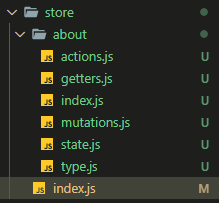

## Vue

### Vue2.0和Vue3.0的变化

#### Vue2.0中Object.defineProperty 和 Vue3.0中proxy

```javascript
let obj = { name: [] };
// proxy
obj = new Proxy(obj, {
    get(target, prop) {
        return target[prop]
    },
    set(target, prop, val) {
        target[prop] = val
    }
})
// Object.defineProperty
let newObj = JSON.parse(JSON.stringify(obj))
Object.defineProperty(obj, 'name', {
    get() {
        return newObj.name
    },
    set(val) {
        newObj.name !== val && (obj.name = val)
    }
})
```

可以看出，Vue3.0对性能是有很大提升的，在Object.defineProperty方法中，需要对每个属性进行递归监听，不但浪费性能，而且如果初始值中没有定义相关属性，就无法进行监听，这也就是Vue2.0中新增属性不会在视图发生变化，从而必须使用$set进行新增属性的原因

------

### Vue2.0

#### 为什么data是个函数

如果两个实例引用同一个对象，当其中一个实例的属性发生改变时，另一个实例属性也随之改变，只有当两个实例拥有自己的作用域时，才不会相互干扰，也就是不会有变量污染

#### 双向数据绑定的原理，如何自定义v-model

Vue2.0: 采用数据劫持结合发布者-订阅者模式的方式，通过`Object.defineProperty()`来劫持各个属性的`setter`，`getter`，在数据变动时发布消息给订阅者，触发相应的监听回调

[实现双向数据绑定](https://www.cnblogs.com/canfoo/p/6891868.html)

- 自定义v-model

  ```html
  <!-- 父组件注册并使用 -->
  <k-input v-model="search" placeholder="请输入搜索关键词"></k-input>
  <!-- 子组件 -->
  <input type="text" :value="value" @input="handleInput" />
  ```

  ```javascript
  //子组件
  export default {
    name: "kInput",
    model: {
      prop: "value",
      event: "input",
    },
    props: ["value"],
    methods: {
      handleInput(e) {
        this.$emit("input", e.target.value);
      },
    },
  };
  ```

#### watch和computed的区别

- watch：监听属性  依赖缓存，只有当依赖发生变化的时候才会重新计算，同时监听多个数据时推荐使用
  - immediate：立即执行
  - deep：深度监听
- computed：计算属性  数据改变立即触发

#### 组件通信

- 父子组件通信

  - 父----->子：props传值，子组件props接收，也可以通过ref获得子组件的数据及方法
  - 子----->父：$emit()调用父组件传递的方法并携带参数给父组件

- 非父子组件通信

  - bus事件总线

  - provide / inject

    ```javascript
    //祖先组件
    provide:{
        provideData:"hello"
    }
    //后代组件
    //1.
    inject:["provideData"]
    //2. 
    inject:{
        provideData:{
            from:"provideData",
            default:"hello"
        }
    }
    ```

  - [Vuex](#Vuex)

#### 封装组件的思路

#### 路由的配置

```javascript
import Vue from "vue";
import vueRouter from "vue-router";
Vue.use(vueRouter);

//嵌套路由
routes: [{
    path: '/offerreward',
    name: 'offerreward',
    component: () => import('路径'),
    children: [{
      path: 'rewIndex',
      name: 'rewardIndex',
      component: () => import('路径'),
    }]
}]
//路由重定向
{ path: '当前路由', redirect: '重定向目标路由'}
//动态路由
{ path: '当前路由/:id', component: () => import('路径')}
//地址栏可以通过 当前路由/123  匹配到当前的路由，页面中可以通过params获取id
//路由传参
//页面中可以通过传递query或者params进行传参，接收参数通过this.$route
```

#### 路由守卫及执行顺序

- 路由守卫
  - `beforeEach`：全局前置守卫
  - `beforeResolve` ：全局解析守卫
  - `beforeEnter` ：路由独享守卫
  - `afterEach`：全局后置守卫
  - `beforeRouteEnter`：组件内守卫，在渲染该组件的对应路由被 confirm 前调用，不能访问this，可以给next传递一个回调获取组件实例（也是唯一可以给next传递回调的钩子）
  - `beforeRouteUpdate`：组件内守卫，在当前路由改变，但是该组件被复用时调用
  - `beforeRouteLeave`：组件内守卫，导航离开该组件的对应路由时调用
- 执行顺序
  - 导航被触发。
  - 在失活的组件里调用 `beforeRouteLeave` 守卫
  - 调用全局的 `beforeEach` 守卫
  - 在重用的组件里调用 `beforeRouteUpdate` 守卫 
  - 在路由配置里调用 `beforeEnter`
  - 解析异步路由组件
  - 在被激活的组件里调用 `beforeRouteEnter`
  - 调用全局的 `beforeResolve` 守卫 
  - 导航被确认
  - 调用全局的 `afterEach` 钩子。
  - 触发 DOM 更新。
  - 用创建好的实例调用 `beforeRouteEnter` 守卫中传给 `next` 的回调函数

#### 编程式导航和声明式导航

- 编程式导航：`router.replace(...)`
- 声明式导航：`<router-link :to="..." replace>`
  - 如何传参：`to="{path:'/test',query:{name:id}}`
- push和replace的区别：
  - push 会向 history 添加一个新的记录

#### 如何进行权限管理

- 菜单管理
  - 纯前端管理：在路由中设置meta标签，设置role数组，登录时将登录人的权限保存，进行判断，菜单栏隐藏或显示
  - 前后端结合：有时菜单是后端返回，同时管理员会有修改权限的功能
  - 当然，两种方式都需要在路由守卫判断当前将要进入的路由是否有相应的权限，如果没有，则重定向到相应的路由

- 操作管理（仅针对前端，后端暂且不提）
  - 根据路由配置中的权限，进行判断

#### 路由模式有哪些，区别是什么

- hash:#后面的字符，改变hash不会重新进行http请求
- history:刷新页面如果没有后端配置，则会作为get请求，导致错误

#### route 和 router 的区别

- router未VueRouter的实例，包含一些属性和方法
- route是当前的路由对象，包含name、path、query等信息

#### mixin

#### 事件修饰符

- `.stop`：阻止冒泡
- `.once` ：只执行一次
- `.native`：监听组件根元素的原生事件

#### 生命周期

- `beforeCreate` ：在实例初始化之后，数据观测 和 event/watcher 事件配置之前被调用。
- `created` ：实例创建完成后被立即调用，数据观测 和 event/watcher 事件已完成，$el无法获取
- `beforeMount` ：在挂载开始之前被调用：相关的 `render` 函数首次被调用
- `mounted` ：实例被挂载后调用，最先获取到DOM，如果加入[$nextTick()](#nextTick原理)，在上面也是可以的
- `beforeUpdate` ：数据更新时调用
- `updated`：数据更改导致的虚拟 DOM 重新渲染之后
- `activated `：被 keep-alive 缓存的组件激活时调用
- `deactivated `：被 keep-alive 缓存的组件停用时调用
- `beforeDestroy` ：实例销毁之前调用
- `destroyed `：实例销毁后调用

#### v-if 和 v-show 的区别

`v-if`: 不渲染，意思就是压根就没有这个元素

`v-show`:  `display:none`

#### v-if 和 v-for 的优先级

v-for 的优先级更高

#### v-for 中为什么传入 key 

使用v-for进行列表渲染的时候，它会默认使用“就地更新”的策略。加入key相当于给每个节点加入id，以便于diff算法更快更准确的找出节点进行渲染

#### Vue中进行跨域请求

```javascript
proxyTable: { 
  '/api': {  //使用"/api"来代替"http://xxxx" 
    target: 'http://xxxx', //源地址 
    changeOrigin: true, //改变源 
    pathRewrite: { 
      '^/api': 'http://xxxx' //路径重写 
      } 
  } 
}
```

#### 请求的封装

#### nextTick原理

在下次DOM更新循环结束之后执行延迟回调

#### Vuex

- 介绍：vue 的状态管理系统 ，state用来定义数据，actions用来触发 mutations 创建的动作，mutations里面修改完数据后，通知vue更新视图

- 用法 (模块化)

  - 文件目录如下：

  

  - store代码

    ```javascript
    //  store/index.js
    import Vue from 'vue'
    import Vuex from 'vuex'
    import About from './about'
    Vue.use(Vuex)
    
    export default new Vuex.Store({
      modules: {
        About //所使用的模块
      }
    })
    
    // store/about/index.js
    import state from './state'
    import actions from './actions'
    import mutations from './mutations'
    import getters from './getters'
    export default {
      namespaced: true,//开启命名空间
      state,           // 定义数据
      mutations,       // 动作的创建者  
      actions,         // 触发动作
      getters          // 获取数据
    }
    
    // store/about/state.js
    const state = {
      count: 0
    }
    export default state
    
    // store/about/type.js
    export const ADD_COUNT = "ADD_COUNT"
    
    // store/about/actions.js
    import * as type from './type'   //动作的类型
    const actions = {
      addCount({ commit }, payload) {
        commit(type.ADD_COUNT, payload)   // 通过commit触发mutations动作，如果是异步修改数据，则必须放在 actions 执行  ，payload是页面中传递的数据
      }
    }
    export default actions
    
    // store/about/mutations.js
    //只可以执行同步代码
    import * as type from './type'
    const mutations = {
      [type.ADD_COUNT](state, payload) {
        state.count = payload   //payload 是 action 传递的数据
      }
    }
    export default mutations
    
    // store/about/getter.js
    const getters = {
      count: state => state.count
    }
    export default getters
    ```

  - 页面中的使用

    ```html
    <div class="about">
        <button @click="ADD_COUNT(8)">+</button>
        <!-- <button @click="addCount(8)">+</button> -->
        <br />
        {{ count }}
        <!--还可以这么写 {{$store.state.count}} -->
     </div>
    ```

    ```javascript
    //没有开启命名空间时：
    // 为了方便书写，vuex提供了四个方法
    import { mapActions, mapGetters, mapMutations, mapState } from "vuex";
    export default {
      computed: {
        // ...mapState(["count"]),// 获取state  等同于 $store.state.count
        ...mapGetters(["count"]), // 获取getter 等同于 $store.getter.count
      },
      methods: {
    	// 当然也可以使用，第二个参数是传递给vuex的数据
        // this.$store.dispatch('addCount',8)对应 actions
        // this.$store.commit('addCount',8)  对应 mutations 
        ...mapActions(["addCount"]),
        ...mapMutations(["ADD_COUNT"]),
      },
    };
    ```

    ```javascript
    // 如果开启了命名空间
    import { mapActions, mapGetters, mapMutations, mapState } from "vuex";
    export default {
      computed: {
        // ...mapState("About", ["count"]),
        ...mapGetters("About", ["count"]),
      },
      methods: {
        ...mapActions("About", ["addCount"]),
        ...mapMutations("About", ["ADD_COUNT"]),
      },
    };
    ```

    

#### diff算法

#### 封装自定义指令   [directive](https://cn.vuejs.org/v2/guide/custom-directive.html)

#### slot

```html
<!-- Child -->
<template>
  <div>
    <div class="header">
      <slot name="header" ></slot>
    </div>
    <slot name="body" :scope="{a:52}"></slot>
  </div>
</template>
```

```html
<Child>
    <template #header>
        我是header
    </template>
    <template v-slot:body="{scope}">
        我是body <div>{{scope}}</div>
    </template>
</Child>
<!--  
我是header
我是body
{ "a": 52 }
-->
```


#### 白屏解决

- 报错白屏
  - publicPath设置
  - 路由模式，app为hash
  - 其他问题（打包配置、资源引用...）
- 首页白屏时间过长
  - 首页加载数据过多
  - 加入loading
  - 路由懒加载

#### 环境变量配置

- .env.development  
- .env.production
- NODE_ENV=当前环境     通过process.env.NODE_ENV获取   package.json  里面  script     --mode development

#### MVVM 和 MVC

- MVVM（[实现](#Vue2.0中Object.defineProperty 和 Vue3.0中proxy))
  - Model:数据模型
  - View:视图
  - ViewModel:模型与视图做了一层绑定关系
- MVC
  - Model:数据模型
  - View:视图
  - Controller:数据模型与View之间的桥梁层

#### keep-alive

缓存不活动的组件实例

- `include` 名称匹配的组件会被缓存。
- `exclude` 名称匹配的组件不会被缓存。
- `max` - 数字。最多可以缓存多少组件实例。

#### assets和static的区别

------

### Vue3.0

#### 组合式 API

##### setup

- 两个参数：props,context
- 在组件创建之前使用
- 访问 `this` 输出 `undefined`
- [传送门](https://vue3js.cn/docs/zh/guide/composition-api-setup.html#%E5%8F%82%E6%95%B0)

##### Provide / Inject的优化

在一定程度下，或许可以考虑替代 Vuex

用法：

```javascript
//1.  祖先组件

// setup 中
import { provide , readonly } from 'vue'
const location = reactive({
    count: 1,
    name: "remons",
});
//  设置为响应式，第一个参数：注入的名称；第二个参数：注入的值
provide("location", location);
// provide("location", readonly(location)); 这样可以保证值不会被改变
// vue 官方推荐的改变 Provide 的方式，后代组件调用祖先组件的方法
const changeLocation = () => {
    location.count++
};
provide('changeLocation',changeLocation)


//2.  后代组件：
import { inject } from 'vue'
// 获取祖先传递的值，第一个参数：祖先传值的名称；第二个参数：默认值
const location = inject("location");
// 此处改变值，则父级的值也会改变
const changeLocation = () => {
    location.count++;
};
// vue 官方推荐使用的改变传值的方式，调用祖先组件的方法
// const changeLocation = inject(changeLocation)
```

#### 响应式 API

##### reactive

##### readonly

对象只读代理（深层）

##### ref

返回一个响应式且可变的 ref 对象

访问时：`.value` ,但在模板中使用可以不用加, `reactive` 中也会自动解套

##### toRefs

将响应式对象转换为普通对象

##### computed 与 watch

- computed

  ```javascript
  import { computed } from 'vue'
  const plusOne = computed(() => count.value + 1)
  ```

- watch

  ```javascript
  const state = reactive({ count: 0 })
  watch(
    () => state.count,
    (count, prevCount) => {
      /* ... */
    }
  )
  ```

  注意：如果 `watch`  监听  `vuex`  值，请将 `watch` 写在 `computed` 之前

##### watchEffect

立即执行传入的一个函数，同时响应式追踪其依赖，组件卸载时自动停止

#### 生命周期

除去加上on 之外，销毁钩子有以下转变，使用时需引入，并在setup中

1. beforeDestroy => onBeforeUnmount
2. destroyed => onUnmounted

新增两个调试钩子

1. onRenderTracked
2. onRenderTriggered

#### 高阶组件（HOC）

#### Vue3的优化

#### 其他变化

------

### Vite

